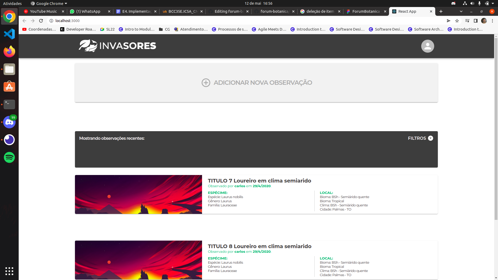
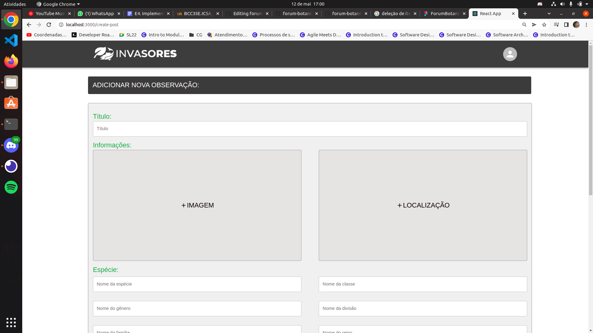

# Implementação 1
## Introdução
&emsp; O problema da falta de mapeamento de seres invasores afeta pesquisadores e estudantes, e pode ser visto pela dificuldade em mensurar o impacto ambiental causado por tais seres, dificultando assim a elaboração de soluções que possam vir a tratar problemas ambientais em uma determinada região. O FÓRUM é um site de biologia que procura mapear os seres invasores de um determinado lugar. Nosso software procura ser informativo de maneira que o usuário consiga visualizar facilmente os seres que não fazem parte de determinado ambiente, além de possibilitar que qualquer pessoa possa ajudar a comunidade fazendo postagens para identificar novos invasores.
\
\
&emsp; Link para o projeto: https://github.com/alescrocaro/forum-botanica/
## Requisitos implementados
&emsp; Resolvemos implementar apenas um requisito nessa primeira entrega, ele foi subdividido em issues menores e todos os quatro membros do grupo participaram.\
\
**REQUISITO: Como usuário, gostaria de criar uma postagem contendo informações sobre o ser invasor encontrado.** \
Issue: https://github.com/alescrocaro/forum-botanica/issues/20 \
Pull request: https://github.com/alescrocaro/forum-botanica/pull/44 \
Implementado por: Alexandre, Caio, Carlos e Leonardo\
Aprovado por: Alexandre (encarregado pela garantia de qualidade)\
Tela de impressão: Para tanto, foi necessário criar três páginas: listagem com todos posts, criação de um post e a de mostrar o post específico. (inserir o print nos subrequisitos fará mais sentido).

**Subrequisito: Fazer o CRUD da tabela de postagens.** \
Issue: https://github.com/alescrocaro/forum-botanica/issues/24 \
Pull request: https://github.com/alescrocaro/forum-botanica/pull/29 \
Implementado por: Alexandre\
Aprovado por: Caio (Alexandre - garantia de qualidade - que fez o PR)\
Tela de impressão: Para tanto, tive que fazer alguns outros requisitos, como a criação de rotas e seu arquivo. Esse CRUD é o responsável pelas funções de criação, remoção e leitura de post(s) no banco de dados, e enviará essa informação para o frontend por meio das rotas citadas. (Não requer print - backend).

**Subrequisito: Criar página de listagem de todos posts com um botão de criar post no topo da tela.** \
Issue: https://github.com/alescrocaro/forum-botanica/issues/25 \
Pull request: https://github.com/alescrocaro/forum-botanica/pull/36 \
Implementado por: Alexandre, Carlos, Caio\
Aprovado por: Caio (Alexandre - garantia de qualidade - que fez o PR)\
Tela de impressão: Como foi a primeira tarefa do frontend demandou algumas outras subtarefas, como criação de rotas, consumir a api do backend e criação de alguns components. Essa página mostrará a listagem com todos os posts criados, um botão para criar um post, além do header e rodapé da página.

**Subrequisito: Criar página para mostrar um post.** \
Issue: https://github.com/alescrocaro/forum-botanica/issues/27 \
Pull request: https://github.com/alescrocaro/forum-botanica/pull/42 \
Implementado por: Alexandre\
Aprovado por: Leonardo (Alexandre - garantia de qualidade - que fez o PR)\
Tela de impressão: Essa página irá mostrar todas as informações disponíveis do post, ela é acessada a partir da página com a listagem de todos posts, clicando no card de um post específico.

**Subrequisito: Sequelize config.** \
Issue:https://github.com/alescrocaro/forum-botanica/issues/23 \
Pull request: https://github.com/alescrocaro/forum-botanica/pull/28 \
Implementado por: Leonardo\
Aprovado por: Alexandre (encarregado pela garantia de qualidade)\
Tela de impressão: Primeira configuração do sequelize no backend.

**Subrequisito: Criar página de criação de post** \
Issue: https://github.com/alescrocaro/forum-botanica/issues/26 \
Pull request: https://github.com/alescrocaro/forum-botanica/pull/44 \ 
Implementado por: Leonardo\
Aprovado por: Alexandre (encarregado pela garantia de qualidade)\
Tela de impressão:  Arrumar alguns dados faltante no modelo de posts.

## Testes
&emsp; O framework que utilizaremos para a implementação dos testes no sistema será o Jest.
## Tecnologias adotadas
 - **React**: uma biblioteca de JavaScript para construir interfaces de usuário baseadas em componentes de UI;
 - **Node**: um ambiente JavaScript orientado a eventos assíncronos, é utilizado para a criação de aplicativos de rede escaláveis;
 - **PostgreSQL**: um sistema gerenciador de banco de dados relacional;
 - **Docker**: possibilita o empacotamento de uma aplicação ou ambiente inteiro dentro de um container.
\
\
&emsp; Escolhemos React e Node pois JavaScript era a linguagem que a maioria dos integrantes do grupo tinha familiaridade em desenvolver, assim facilitando a implementação do sistema e não precisando se adaptar a tecnologias desconhecidas, o Jest pois nosso grupo teve experiência utilizando ele em algumas aulas práticas na disciplina de Projeto Integrador, o PostgreSQL pois trabalharemos com geolocalizações e o Docker para configurar o ambiente de maneira mais acessível e descomplicada.

## Aprendizado/treinamento
&emsp; Alguns membros já conheciam as tecnologias, ao precisar aprender algo, foi realizada através da troca de conhecimento interno, como também vídeoaulas no YouTube e cursos online.

## Implantação
O sistema ainda não foi implantado.

## Licenciamento
A licença escolhida foi a [MIT](https://choosealicense.com/licenses/mit/), mais informações no arquivo [LICENSE](https://github.com/alescrocaro/forum-botanica/blob/main/LICENSE). Escolhemos esta licença por ser simples e permissiva para contribuidores.

## Look & feel
[Figma](https://www.figma.com/file/47dw3vy9BFAVzXzNb87h7j/ForumBotanica?node-id=1%3A3143) \
[Prints](https://github.com/alescrocaro/forum-botanica/blob/main/frontend/design/ForumBotanica.pdf)

## Lições aprendidas
Alguns dos membros utilizaram conhecimentos prévios das linguagens e frameworks, outros tiveram que aprender (por meio de troca de conhecimento entre os membros ou vídeos online), além de ser um contato direto com metodologia ágeis e utilização mais complexa do github, ótima forma de conseguir experiência com essas tecnologias.

## Demo
resolver na prox aula
