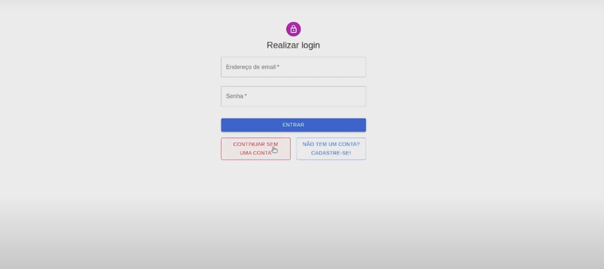
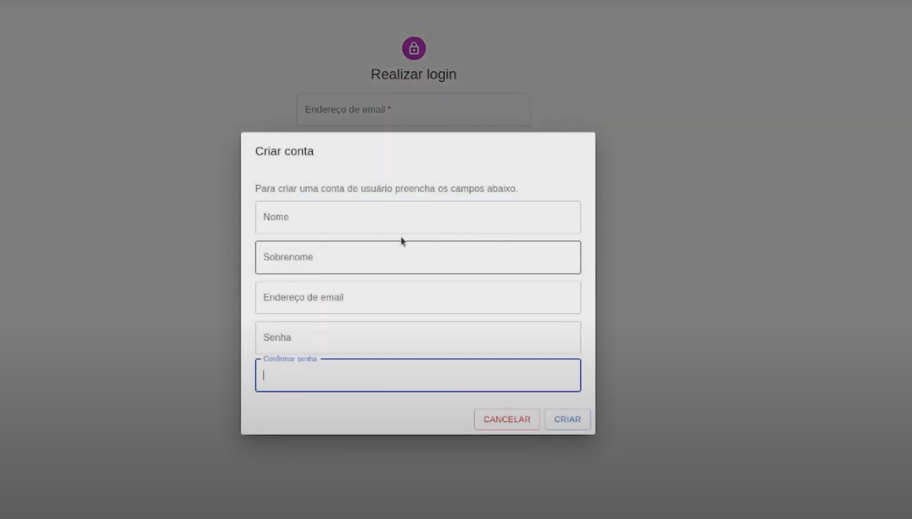
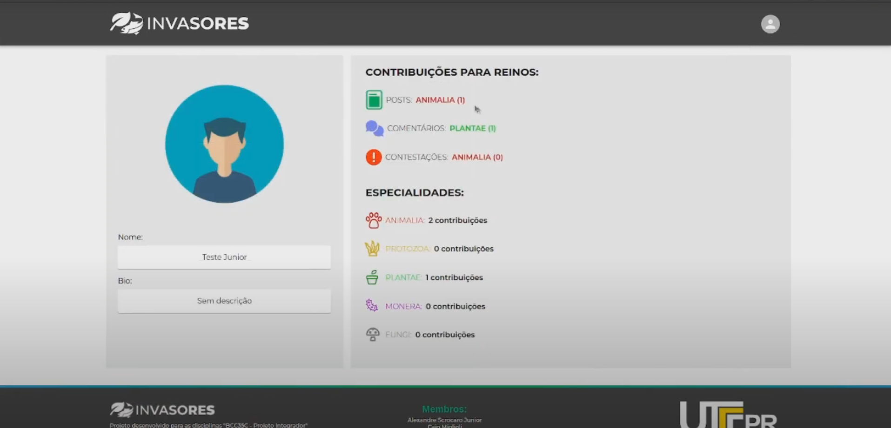

# Implementação 2 
 
##	Introdução
&emsp; O problema da falta de mapeamento de seres invasores afeta pesquisadores e estudantes, e pode ser visto pela dificuldade em mensurar o impacto ambiental causado por tais seres, dificultando assim a elaboração de soluções que possam vir a tratar problemas ambientais em uma determinada região. O Invasores é um fórum de biologia que procura mapear os seres invasores de um determinado lugar. Nosso software procura ser informativo de maneira que o usuário consiga visualizar facilmente os seres que não fazem parte de determinado ambiente, além de possibilitar que qualquer pessoa possa ajudar a comunidade fazendo postagens para identificar novos invasores. Atualmente o software consiste em uma tela inicial com um mapa para visualização dos seres invasores, uma listagem de posts feitos por todos usuários e uma filtragem a partir de um raio de busca; uma tela para mostrar o post com todas suas informações, tags (#) e uma seção de comentários; e por fim uma tela de criação de posts, na qual podem ser inseridas informações científicas, de geolocalidade e upload de imagens.
\
\
&emsp; Link para o projeto: https://github.com/alescrocaro/forum-botanica/
 
 
 
## Requisitos implementados
&emsp; Como utilizamos a metodologia SCRUM na matéria de Projeto Integrador, realizamos mais de uma sprint nesta implementação.\
\
**REQUISITO: Como usuário, gostaria de comentar em uma postagem para contribuir com mais dados (RFCOFGE), caso esteja faltando, para uma descrição mais completa.** \
Issue: https://github.com/alescrocaro/forum-botanica/issues/16 \
Pull request: https://github.com/alescrocaro/forum-botanica/pull/59 \
Implementado por: Alexandre\
Aprovado por: Carlos\
Tarefas: 
 - Criar migration da tabela de comentários;
 - Fazer CRUD da tabela de comentários;
 - Mostrar comentários na página do post;
 - Fazer campo para postar comentário.

Print: 

**REQUISITO: Como usuário, gostaria de anexar uma geolocalização à minha postagem para que seja possível identificar se o ser é invasor daquela área específica.** \
Issue: https://github.com/alescrocaro/forum-botanica/issues/10 \
Pull request: https://github.com/alescrocaro/forum-botanica/pull/60 \
Implementado por: Caio\
Aprovado por: Carlos\
Tarefas: 
 - Estudar, definir e conectar alternativa (google maps, etc) para geolocalização no front end;
 - Atualização nas rotas de post e get de criação de post para conter geolocalização (olhar POSTGIS e dados geograficos no sequelize);
 - Colocar mapa com geolocalização na página de criação de post;
 - Colocar mapa com geolocalização na página do post;
 - Colocar mapa com geolocalização na página inicial;

Print: 

**REQUISITO: Como usuário, gostaria de anexar uma imagem à minha postagem para que facilite a visualização do ser, além de facilitar a discussão.** \
Issue: https://github.com/alescrocaro/forum-botanica/issues/9 \
Pull request: https://github.com/alescrocaro/forum-botanica/pull/70 \
Implementado por: Leonardo\
Aprovado por: Carlos\
Tarefas: 
 - Mostrar imagens no front end;
 - Atualizar a rota de criação de post para enviar as imagens;
 - Fazer o envio da imagem da espécie no front end.
Print: Uma tela que mostre o recurso implementado (se aplicável)

**REQUISITO: Como usuário, gostaria de contestar uma postagem para que não haja dados inconsistentes no banco.** \
Issue: https://github.com/alescrocaro/forum-botanica/issues/66 \
Pull request: https://github.com/alescrocaro/forum-botanica/pull/74 \
Implementado por: Alexandre\
Aprovado por: Carlos\
Tarefas: 
 - Como usuário gostaria de fazer um comentário de contestação em uma postagem;
 - Fazer o tratamento de dados de uma postagem contestada.
Print: Uma tela que mostre o recurso implementado (se aplicável)

**REQUISITO: Como usuário, gostaria de definir um raio de busca em meus filtros de busca para me certificar que estou abordando apenas a área que estou interessado.** \
Issue: https://github.com/alescrocaro/forum-botanica/issues/13 \
Pull request: https://github.com/alescrocaro/forum-botanica/pull/91 \
Implementado por: Caio\
Aprovado por: Carlos\
Tarefas: 
 - Adicionar Slider para definição do Raio, Marker e Geometry no mapa;
 - Alterar a rota findAll posts para adicionar os filtros.

Print:  

**REQUISITO: Como usuário, gostaria de marcar minhas postagens com tags, para que elas apareçam em pesquisas junta com outras postagens com as mesmas tags.** \
Issue: https://github.com/alescrocaro/forum-botanica/issues/21 \
Pull request: https://github.com/alescrocaro/forum-botanica/pull/89 \
Implementado por: Carlos e Leonardo\
Aprovado por: Carlos\
Tarefas: ?
Print: Uma tela que mostre o recurso implementado (se aplicável)

**REQUISITO: Criar sistema de usuários.** \
Issue: https://github.com/alescrocaro/forum-botanica/issues/73 \
Pull request: https://github.com/alescrocaro/forum-botanica/pull/111 \
Implementado por: Alexandre e Leonardo\
Aprovado por: Carlos\
Tarefas: 
 - Criar tela de login
 - Criar modal de criação de usuário
 - criar rota de criação de usuário 
 - Criar rota de autenticação com JWT
 - Conectar login com rota de autenticação do backend
 - Criar tela de perfil de usuário 
 - Criar rota de perfil do usuário
 - Alterar dados enviados pela rota de perfil do usuário 
 - Relacionar usuário a um post 
 - Relacionar usuário ao comentário
 
Print:

## Testes
&emsp; O framework que utilizaremos para a implementação dos testes no sistema será o Jest.\
&emsp;[Pasta de testes](https://github.com/alescrocaro/forum-invasores/tree/main/backend/tests)\
 
 
 
## Demo
[Segunda demo](https://www.youtube.com/watch?v=qEf3xQMGk6U)

 
##	Qualidade do código
Descreva como sua equipe gerenciou a qualidade do código. Quais foram suas políticas, convenções, práticas recomendadas adotadas, etc. para promover o código de alta qualidade? 

Quando feitos os Pull Requests, o responsável pela garantia de qualidade realizou testes manuais a procura de bugs, eles eram aprovados somente quando não a branch main não seria afetada negativamente (com bugs).

 
 
##	Lições aprendidas
Na parte do frontend, aprendi brevemente sobre responsividade (como media query) por meio de pesquisas, mas não tive tempo de aplicar esse conhecimento no projeto e como já tinha algum conhecimento acerca de React consegui realizar o resto das tarefas tranquilamente. Como não tinha nenhum conhecimento no backend, tive que aprender por meio de vídeos e com auxílio do Leonardo consegui fazer as tarefas que precisei (com algum esforço). 
Para continuar a desenvolver o projeto, acredito que teria que refatorar algumas partes do código - que foram feitas rapidamente e que sei que poderiam ter sido escritas de maneira muito melhor. Assim como ajustar a responsividade do site para celulares e pensar em futuras funcionalidades.

Definir a implementação de um requisito que terá funcionalidades implementadas em outros momentos é muito mais difícil do que parece. Ao lidar com os mapas, optei por utilizar uma biblioteca de terceiros que implementava o Leaflet, e isso me limitou e me impediu de implementar as funcionalidades necessárias em outras sprints e issues, me obrigando a alterar completamente a implementação dos mapas.\
Ao alterar a minha abordagem com o Leaflet (mapas), me deparei com bugs causados pelo modo que o React lida com a renderização de componente, e pra resolver isso tive que aprender o Ciclo de Vida de um componente React, o que mudou minha visão sobre como os componentes dinâmicos se comportam ou deveriam se comportar, entendendo melhor as responsabilidades que cada componente deve ter.\
E por fim, enfrentei algumas vezes situações em que tive que trocar informações entre componentes (módulos) independentes, algo que resolvi aprendendo sobre os hooks, jogando informações importantes para o componente pai, e apenas alterando a variável nos componentes.\
O que eu levo disso é que muitas vezes é preciso entender algo por completo e imaginar suas futuras utilizações para definir como implementar, pois pode causar muita dor de cabeça futuramente, e se eu fosse continuar esse projeto, daria mais importância ao planejamento, inclusive de pequenas funcionalidades. Fora isso, eu faria muita refatoração levando em conta o que aprendi sobre os componentes (módulos), seu ciclo de vida e suas responsabilidades, pois quando se aprende as possibilidades na prática, todos os principios teóricos se tornam mais tangíveis e se tornam claro a necessidade de padronizar e dividir.
